# Starter Guide: Using Terraform and cloud-init to manage VMs on Proxmox

This is a small starter guide on how to use Terraform and cloud-init to deploy virtual machines on Proxmox v8+.  

## Notes
- This guide and it's commands are written for Linux (bash/zsh).  
  To follow along on a Windows machine, please consider [using WSL2](https://learn.microsoft.com/en-us/windows/wsl/install).  
- The Guest Agent will not be installed/activated in this guide as of the following reasons:
  - It is not installed in the the image we create out template from
  - As this is a starter guide it is not installed using cloud-init
  - If activated Terraform seems to wait for it becoming available and will run into a timeout
- We will omit adding the cloud-init drive while preparing the template as 
  - Terraform will ad it's own cloud-init image and remove the one given by the template
  - The VM will not start up if the cloud-init image gets replaced during VM creation.
    Maybe I am wrong but that's what I have in mind as a result of my latest tests.
  - So if you plan to create VMs manually using a template you might have to create a second template that includes the cloud-init image.
- The guide covers just the basic cloud init options (user/password, sshkey) not the advanced abilities you have using a custom cloud-init file (see https://registry.terraform.io/providers/Telmate/proxmox/latest/docs/guides/cloud_init)

## Prerequisites
The following describes the core components required to follow this guide, 
including the versions for each component as of writing this guide.  

### Software

| Component | Version | Install instructions |
|-----------|---------|----------------------|
|Proxmox    |v8.2.5   |[Proxmox](https://www.proxmox.com/en/proxmox-virtual-environment/get-started)|
|Terraform  |v1.9.6   |[Hashicorp](https://developer.hashicorp.com/terraform/tutorials/aws-get-started/install-cli)|
|VS Code    |v1.93.1  |[Microsoft](https://code.visualstudio.com/download)|
|Terraform extension|v2.32.3 |[VS Code Marketplace](https://marketplace.visualstudio.com/items?itemName=HashiCorp.terraform)|

### Cloud-init images
As we will use cloud-init to pre-configure our VMs we need to choose a cloud-init-ready image for our Linux distro.  
While this guide refers to Ubuntu-based images (the other distros have not been tested by me yet), the following table contains some additional sources for cloud-init images of other distros.  

| Distro | Release | Codename | Download |
|--------|---------|----------|----------|
| <strong>Ubuntu</strong> |
| Ubuntu | - | - | https://cloud-images.ubuntu.com/ |
| Ubuntu | 22.04 | jammy | https://cloud-images.ubuntu.com/jammy/current/jammy-server-cloudimg-amd64.img |
| Ubuntu | 24.04 | noble | https://cloud-images.ubuntu.com/noble/current/noble-server-cloudimg-amd64.img |
| <strong>Debian</strong> |
| Debian | - | - | https://cloud.debian.org/images/cloud/ |
| Debian | 10 | buster | https://cloud.debian.org/images/cloud/buster/latest/debian-10-generic-arm64.qcow2 |
| Debian | 11 | bullseye | https://cloud.debian.org/images/cloud/bullseye/latest/debian-11-generic-amd64.qcow2 |
| Debian | 12 | bookworm | https://cloud.debian.org/images/cloud/bookworm/latest/debian-12-generic-amd64.qcow2 |
| <strong>Rocky Linux</strong> |
| Rocky  | - | - | https://rockylinux.org/download |
| Rocky  | 8 | - | https://dl.rockylinux.org/pub/rocky/8/images/x86_64/Rocky-8-GenericCloud-Base.latest.x86_64.qcow2 |
| Rocky  | 9 | - | https://dl.rockylinux.org/pub/rocky/9/images/x86_64/Rocky-9-GenericCloud-Base.latest.x86_64.qcow2 |

### Proxmox API access

In order to access the Proxmox API via Terraform you need to use either
- the credentials (username/password) of a (new or existing) user or
- an API token for a (new or existing) user in Proxmox  

where the user (or token) has been granted all required roles.  

As this guide is NOT written for PRODUCTION environments, we'll create a token for the root account:  
1) Sign in into the Proxmox Admin UI (https://\<your proxmox IP>:8006)
2) In the server view click on "Datacenter" -> Permissions -> API Tokens -> Add
3) Select the user, name the token, add a comment (optional), UNCHECK "Privilege Separation", set expiration date click "Add"
4) Copy the token and keep it in a safe place as it's only shown once  

#### Example:  

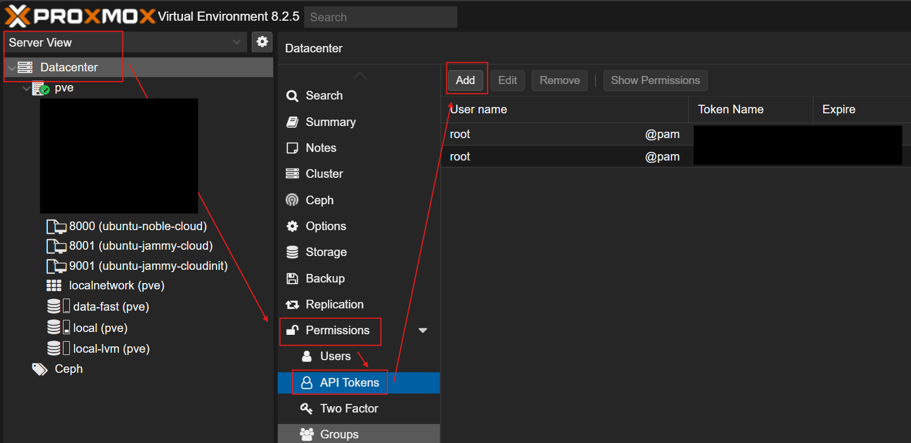  

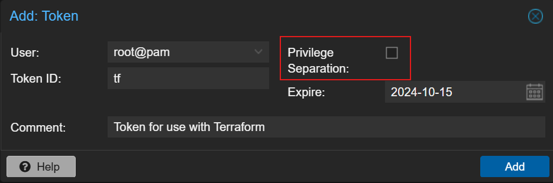  

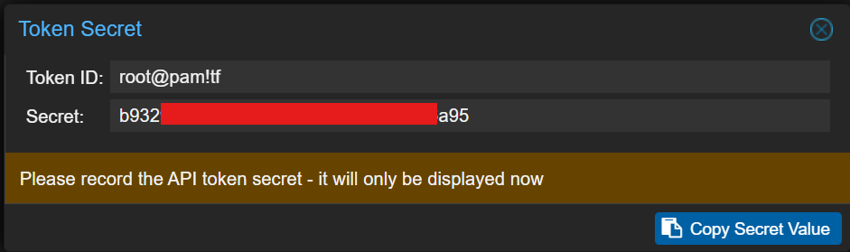  

> _These values have to be set later in the `credentials.auto.tfvars` file:_  
>   
> "Token ID" -> `pm_api_token_id`  
> "Secret" -> `pm_api_token_secret`  
> &nbsp;

## Create a VM template
the prerequisits should be in place now so we can start by creating our VM template in Proxmox for use with Terraform.  
As mentioned above we will use Ubuntu as our distro.  

### Create VM
1) Open a shell
2) ssh into your Proxmox server
3) Run the following commands to create a VM which will be converted into a template once we are done

> We will use 8000 as the VM/Template id - please adjust this accoring to your preferences
```bash
# Download the cloud image (Ubuntu 24.04 in this case)
wget https://cloud-images.ubuntu.com/noble/current/noble-server-cloudimg-amd64.img

# Create a VM with 2 cores, 2GB RAM and a network interface
qm create 8000 --memory 2048 --cores 2 --name ubuntu-noble-cloud --net0 virtio,bridge=vmbr0

# Import the cloud image as boot disk (using default storage "local-lvm", please adjust this accoring to your preferences)
qm importdisk 8000 noble-server-cloudimg-amd64.img local-lvm

# Set the storage controller and attach the imported disk drive
qm set 8000 --scsihw virtio-scsi-pci --scsi0 local-lvm:vm-8000-disk-0

# !!! Attention !!!
# We will omit creating a cloud-init drive for this template as terraform will create one for us later on
# qm set 8000 --ide2 local-lvm:cloudinit

# Set the boot drive
qm set 8000 --boot c --bootdisk scsi0

# Add serial socket as well as the socket for display output
qm set 8000 --serial0 socket --vga serial0
```

Once you ran the commands there sould be a new (powered off) VM be listed in Proxmox.  

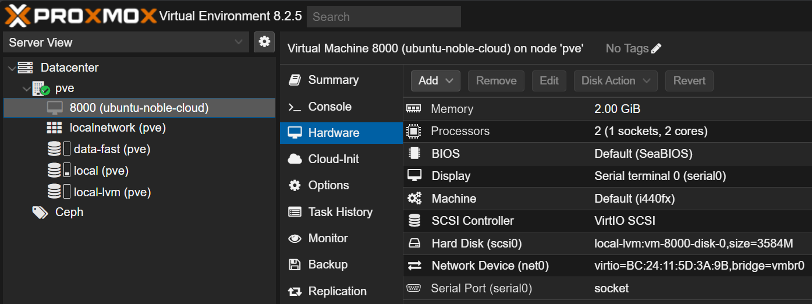  

In order to convert the VM into a template we have to right-click the VM and select "Convert to template"  

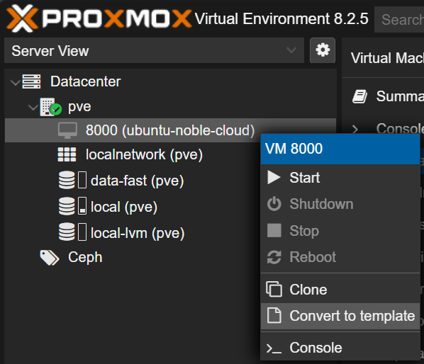  

Confirm conversion.  

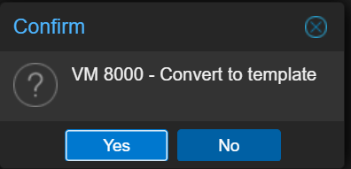  

Once the conversion finished you should see the icon of the VM has changed to the template icon.  

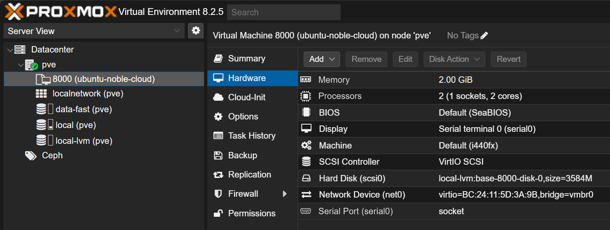  

At this point we prepared
- API token for Proxmox
- Cloud-init VM template  

so we are ready to head over to Terraform...

## Setup project

### Create folder and files
Open a shell and create your project folder

```bash
# Create project folder and cd into it
mkdir -p ~/src/tutorials/proxmox-terraform && cd $_

# Create the files we will use
touch .gitignore
touch variables.tf
touch terraform.tfvars
touch credentials.auto.tfvars
touch provider.tf
touch main.tf

# Open the project in VS Code
code .
```

### Add content to the files

In VS Code paste the following file contents, which can also be found in the [examples/proxmox-terraform](examples/proxmox-terraform) folder.  

> ### HINT  
> Remember to adjust the variable values in `credentials.auto.tfvars` as well as `terraform.tfvars`  
> &nbsp;


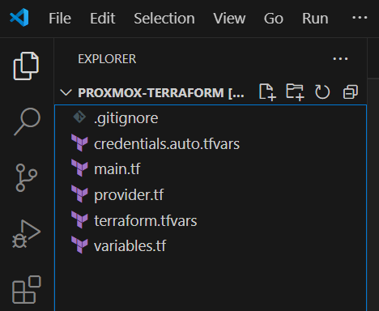

#### .gitignore  
```plain filename=".gitignore"
**/*.auto.tfvars
terraform/terraform.tfstate
terraform/terraform.tfstate.backup
terraform/.terraform.lock.hcl
terraform/.terraform
terraform/variables.tfvars
terraform/.terraform.tfstate.lock.info
terraform/terraform-plugin-proxmox.log

# Local .terraform directories
**/.terraform/*

# .tfstate files
*.tfstate
*.tfstate.*

# Crash log files
crash.log
crash.*.log

# Exclude all .tfvars files, which are likely to contain sensitive data, such as
# password, private keys, and other secrets. These should not be part of version 
# control as they are data points which are potentially sensitive and subject 
# to change depending on the environment.
*.tfvars
*.tfvars.json

# Ignore override files as they are usually used to override resources locally and so
# are not checked in
override.tf
override.tf.json
*_override.tf
*_override.tf.json

# Include override files you do wish to add to version control using negated pattern
# !example_override.tf

# Include tfplan files to ignore the plan output of command: terraform plan -out=tfplan
# example: *tfplan*

# Ignore CLI configuration files
.terraformrc
terraform.rc
```

#### variables.tf  
```terraform filename="variables.tf"
variable "template_vm_name" {
  description = "Name of the template to use for creating VMs"
  type = string
}

variable "pm_tls_insecure" {
  type      =  bool
  sensitive = false
}

variable "pm_host" {
  description = "The hostname or IP of the proxmox server"
  type        = string
}

variable "pm_node_name" {
  description = "Name of the proxmox node to create the VMs on"
  type        = string
  default     = "pve"
}

variable "pm_api_token_id" {
  description = "Name of the proxmox api token"
  type        = string
  sensitive   = true
}

variable "pm_api_token_secret" {
  description = "The proxmox api token secret"
  type        = string
  sensitive   = true
}

variable "pm_ci_user" {
  description = "Cloud-init username"
  type        = string
  sensitive   = true
}

variable "pm_ci_password" {
  description = "Cloud-init password for the user"
  type        = string
  sensitive   = true
}

variable "pm_ci_sshkeys" {
  description = "Cloud-init ssh keys"
  type        = string
  sensitive   = true
}

```  

#### terraform.tfvars  

> !!! Remember to adjust the variable values  

```terraform filename="terraform.tfvars"
pm_host = "<your proxmox hostname or IP address, e.g. pve.home.lab or 10.0.10.100>"
pm_node_name = "<your proxmox node name, e.g. pve>"
pm_tls_insecure = true # Set to false if possible (PVE cert signed by trusted CA)

# Set to the template name we specified while creating the template VM
template_vm_name = "ubuntu-noble-cloud"
```

#### credentials.auto.tfvars  

> !!! Remember to adjust the variable values  

```terraform filename="credentials.auto.tfvars"
pm_api_token_id = "<id of your Proxmox token, e.g. 'root@pam!terraform'>"
pm_api_token_secret = "<token secret given by Proxmox, e.g. '00000000-0000-0000-0000-000000000001'>"

pm_ci_user = "<username to use on VMs>"
pm_ci_password = "<password to use on VMs>"
pm_ci_sshkeys = "<ssh public key>"
```

#### provider.tf  

> !!! Check for newer releases  
> https://registry.terraform.io/providers/Telmate/proxmox/latest  

```terraform filename="provider.tf"
terraform {
  required_providers {
    proxmox = {
      source = "telmate/proxmox"
      version = "3.0.1-rc4"
    }
  }
}

provider "proxmox" {
  pm_api_url          = "https://${var.pm_host}:8006/api2/json"
  pm_api_token_id     = var.pm_api_token_id
  pm_api_token_secret = var.pm_api_token_secret
  pm_tls_insecure     = var.pm_tls_insecure
  pm_parallel         = 10
  pm_timeout          = 600
  pm_debug            = true
  pm_log_enable       = true
  pm_log_file         = "terraform-plugin-proxmox.log"
  pm_log_levels       = {
    _default    = "debug"
    _capturelog = ""
  }
}
```

#### main.tf  
```terraform filename="main.tf"
resource "proxmox_vm_qemu" "terraform-test-vm" {
    name = "terraform-test-vm"
    desc = "A test for using terraform and cloudinit"

    # Node name has to be the same name as within the cluster
    # this might not include the FQDN
    target_node = var.pm_node_name

    # The template name to clone this vm from
    clone = var.template_vm_name

    # Activate QEMU agent for this VM
    # Should only be used if you use an image that already has the agent installed
    # or if you extend your clound init and install it during initialization.
    # Otherwise terraform will fail with a timeout waiting for the agent to become active.
    agent = 0

    os_type = "cloud-init"
    cores = 2
    sockets = 1
    vcpus = 0
    cpu = "host"
    memory = 2048
    scsihw = "virtio-scsi-pci"

    # Do not forget to enable console output
    serial {
      id = 0
    }

    # Setup the disk
    disks {
      ide {
        ide2 {
          cloudinit {
              storage = "local-lvm"
          }
        }
      }
      scsi {
        scsi0 {
          disk {
            size    = "32G"
            storage = "local-lvm"
          }
        }
      }
    }

    # Setup the network interface
    network {
        model = "virtio"
        bridge = "vmbr0"
    }
    
    # Specify the boot order
    # Needs to include the cloud-init drive (or seems to...)
    boot = "order=scsi0;ide2"

    # Set the cloud init values (user, password, sshkey/s)
    ciuser      = var.pm_ci_user
    cipassword  = var.pm_ci_password
    sshkeys     = var.pm_ci_sshkeys

    ciupgrade   = false # Set to "true" to do an automatic package upgrade after the first boot

    # Setup the ip address using cloud-init.
    # Keep in mind to use the CIDR notation as well as adding the gateway if using a static ip.
    ipconfig0 = "ip=dhcp"
}
```

### Initialize Terraform
This will install the proxmox provider

```bash
terraform init
```

### Test the project

Now we are ready to deploy our first VM.

```bash
# Let's see what changes Terraform will detect
terraform plan

# And ... deploy them
terraform apply
```

In case everything went well we should see a new VM in Proxmox and be able to login with the credentials we set in our `credentials.auto.tfvars` file.

### VM booted
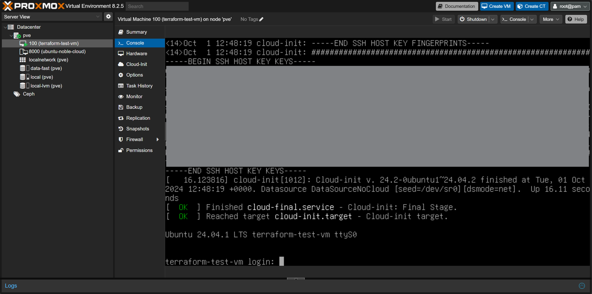

### Login success
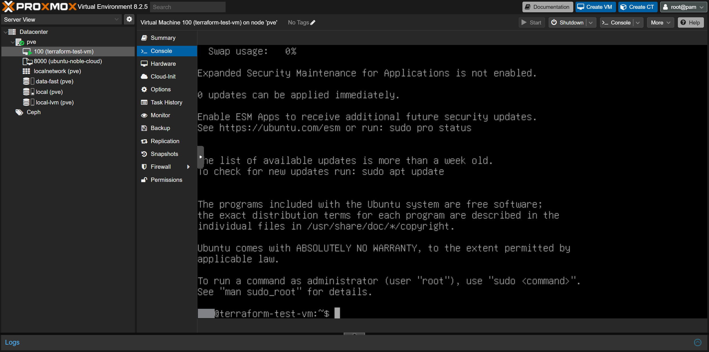

### Hardware tab
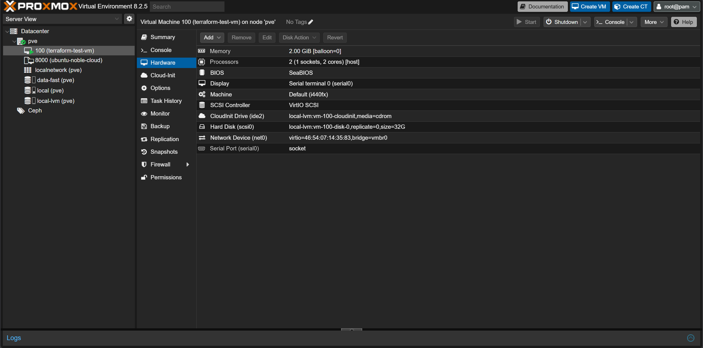

### Cloud-Init tab
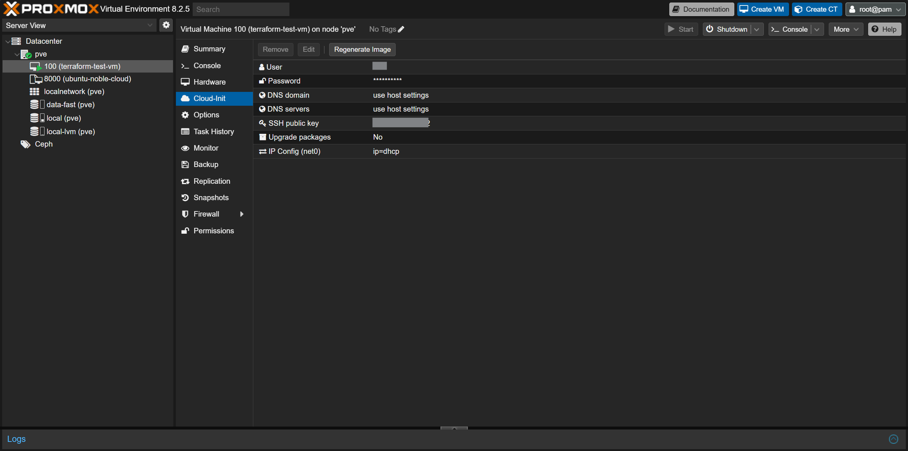

### Options tab
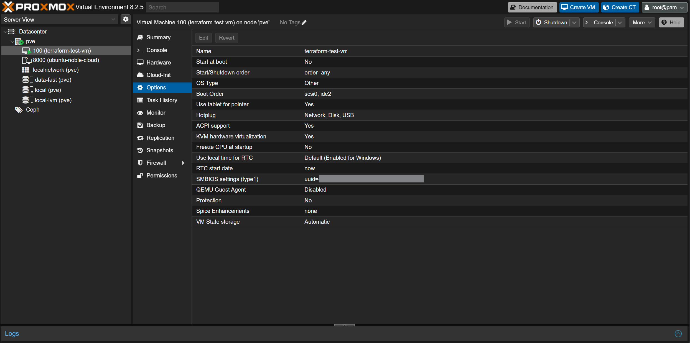

## Cleanup
This will delete the VM we provisioned using Terraform but not the VM template

```bash
terraform destroy
```

# Lincense
None - free to use.